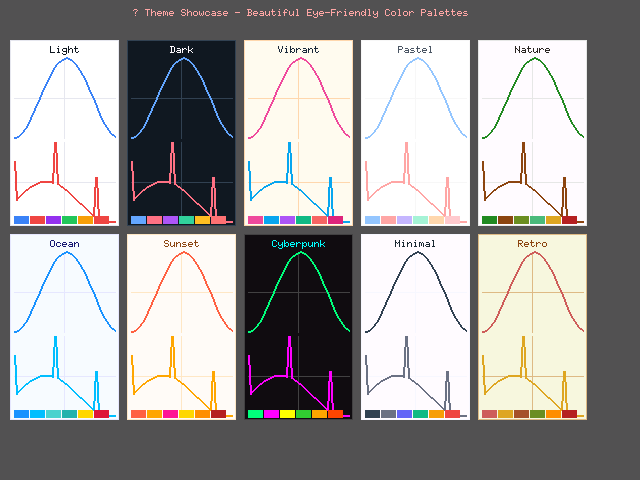
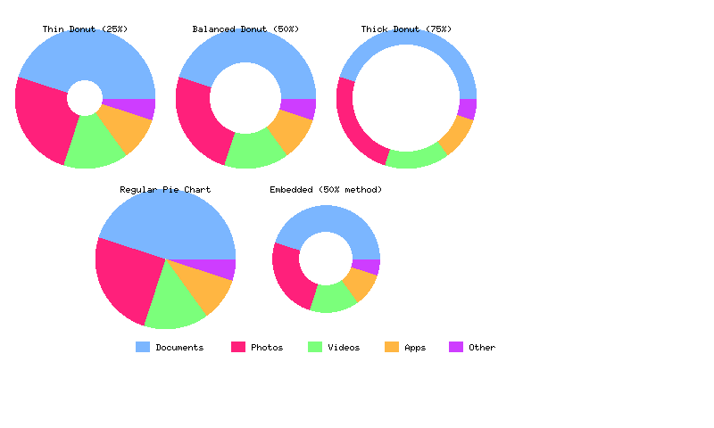

# Embedded Charts

[](https://crates.io/crates/embedded-charts)
[](https://docs.rs/embedded-charts)
[](https://github.com/signal-slot/embedded-charts/actions)
[](https://github.com/signal-slot/embedded-charts#license)

A production-ready, no_std graph framework for embedded systems using embedded-graphics.

This library provides comprehensive chart types (line, bar, pie, donut), axes, grids, legends, real-time data streaming capabilities, and customizable styling while maintaining memory efficiency and performance suitable for resource-constrained environments.

## 🎨 Visual Showcase

### Professional Theme Collection

*Complete collection of all professional color themes optimized for different display types and use cases*

### Chart Type Gallery
<div align="center">
  <table>
    <tr>
      <td align="center">
        
        <br><b>Line Charts</b><br>Multi-series, markers, area filling
      </td>
      <td align="center">
        
        <br><b>Bar Charts</b><br>Vertical/horizontal, stacked support
      </td>
    </tr>
    <tr>
      <td align="center">
        
        <br><b>Pie Charts</b><br>Full circles, custom colors, professional styling
      </td>
    </tr>
    <tr>
      <td align="center">
        
        <br><b>Donut Charts</b><br>Hollow centers, multiple sizes, embedded-optimized
      </td>
      <td align="center">
        
        <br><b>Gauge Charts</b><br>Semicircle, threshold zones, indicators
      </td>
    </tr>
  </table>
</div>

### Animated Chart Demonstrations
<div align="center">
  <table>
    <tr>
      <td align="center">
        
        <br><b>Real-time Streaming</b><br>Live data updates with smooth animations
      </td>
      <td align="center">
        
        <br><b>Animated Stacked Charts</b><br>Dynamic data transitions and growth effects
      </td>
    </tr>
    <tr>
      <td align="center">
        
        <br><b>IoT Sensor Dashboard</b><br>Multi-sensor real-time monitoring
      </td>
      <td align="center">
        
        <br><b>System Monitoring</b><br>Comprehensive system metrics visualization
      </td>
    </tr>
    <tr>
      <td align="center">
        
        <br><b>Production Auto-Redraw</b><br>Real-time production monitoring with automatic updates
      </td>
      <td align="center">
        
        <br><b>Advanced Scatter Plots</b><br>Auto-cycling between basic and clustered modes
      </td>
    </tr>
  </table>
</div>

## 🚀 Production Ready Features

### ✅ Complete Chart Types
- **Line Charts**: Multi-series support, markers (circle, square, triangle, diamond), area filling
- **Bar Charts**: Vertical/horizontal, stacked bars, custom colors and spacing
- **Pie Charts**: Full circles, donut charts, custom colors and labels
- **Gauge Charts**: ✅ COMPLETE - Semicircle/full circle gauges, threshold zones, needle animations, custom indicators
- **Scatter Charts**: ✅ COMPLETE - Bubble charts, size/color mapping, collision detection, multiple point shapes

### ✅ Advanced Rendering
- **Axes System**: Linear axes with customizable ticks, labels, and formatting
- **Grid System**: Major/minor grids, tick-aligned grids, custom spacing
- **Legend System**: Multiple orientations, custom styling, automatic positioning
- **Triangle Filling**: Efficient area filling algorithms for complex shapes

### ✅ Professional Styling
- **Color Palettes**: Professional, pastel, and custom color schemes
- **Themes**: Built-in themes optimized for different display types
- **Typography**: Font support with customizable text rendering
- **Markers**: Circle, square, triangle, diamond shapes with custom sizes

### ✅ Memory Efficiency
- **Static Allocation**: Compile-time memory bounds, no heap usage
- **Configurable Capacity**: Adjust memory usage per application needs
- **no_std Compatible**: Full compatibility with embedded environments
- **Zero-cost Abstractions**: High-level API with no runtime overhead

### ✅ Real-time Animation
- **Streaming Data**: Live data updates with smooth transitions
- **Animation System**: Configurable easing functions and timing
- **Auto-redraw**: Automatic chart updates for dynamic data
- **Performance Optimized**: Efficient rendering for resource-constrained systems

## 📊 Feature Matrix

| Feature | Status | Description |
|---------|--------|-------------|
| Line Charts | ✅ Complete | Multi-series, markers, area filling |
| Bar Charts | ✅ Complete | Vertical/horizontal, stacked support |
| Pie Charts | ✅ Complete | Full circles, professional styling |
| Donut Charts | ✅ Complete | Hollow centers, percentage-based sizing |
| Gauge Charts | ✅ Complete | Semicircle gauges, threshold zones |
| Scatter Charts | ✅ Complete | Clustering, collision detection |
| Axes System | ✅ Complete | Linear axes, ticks, labels |
| Grid System | ✅ Complete | Major/minor grids, alignment |
| Legend System | ✅ Complete | Multiple layouts, styling |
| Color Palettes | ✅ Complete | Professional color schemes |
| Memory Management | ✅ Complete | Static allocation, configurable |
| no_std Support | ✅ Complete | Full embedded compatibility |
| Triangle Filling | ✅ Complete | Efficient area rendering |
| Streaming Animation | ✅ Complete | Real-time animated charts |

## 🛠️ Installation

Add this to your `Cargo.toml`:

```toml
[dependencies]
embedded-charts = "0.1.0"
embedded-graphics = "0.8"
```

### Feature Flags

Configure the library for your target system:

```toml
[dependencies]
embedded-charts = {
    version = "0.1.0",
    features = ["color-support", "fonts"]
}
```

#### Chart Features
- `basic-charts`: Line, bar, pie, donut charts (default)
- `advanced-charts`: Scatter plots, gauges, custom charts
- `stacked-charts`: Stacked bar and area chart support
- `donut`: Donut chart support

#### Rendering Features
- `color-support`: RGB color palettes and themes
- `fonts`: Text rendering and typography
- `anti-aliasing`: Smooth line rendering (requires micromath)
- `animations`: Real-time animations and transitions
- `capture`: Screenshot and GIF capture for documentation (std only)

## 🚀 Quick Start

### Basic Line Chart

```rust
use embedded_charts::prelude::*;
use embedded_graphics::{pixelcolor::Rgb565, prelude::*};

// Create sample data
let data = data_points![(0.0, 10.0), (1.0, 20.0), (2.0, 15.0), (3.0, 25.0)];

// Build a line chart
let chart = LineChart::builder()
    .line_color(Rgb565::BLUE)
    .line_width(2)
    .with_markers(MarkerStyle {
        shape: MarkerShape::Circle,
        size: 6,
        color: Rgb565::RED,
        visible: true,
    })
    .build()?;

// Configure the chart
let config = chart_config! {
    title: "Temperature Over Time",
    background: Rgb565::WHITE,
    margins: constants::STANDARD_MARGINS,
    grid: true,
};

// Render to display
chart.draw(&data, &config, viewport, &mut display)?;
```

### Professional Multi-Series Chart

```rust
use embedded_charts::prelude::*;

// Create multiple data series
let temp_data = data_points![(0.0, 22.5), (1.0, 23.1), (2.0, 24.2), (3.0, 23.8)];
let humidity_data = data_points![(0.0, 65.0), (1.0, 68.0), (2.0, 72.0), (3.0, 70.0)];

// Create multi-series container
let mut multi_series = MultiSeries::new();
multi_series.add_series("Temperature", temp_data)?;
multi_series.add_series("Humidity", humidity_data)?;

// Build chart with professional styling
let chart = professional_line_chart()
    .with_legend(Legend::builder()
        .position(LegendPosition::TopRight)
        .orientation(LegendOrientation::Vertical)
        .build()?)
    .with_axes(LinearAxis::builder()
        .x_label("Time (hours)")
        .y_label("Value")
        .build()?)
    .build()?;

chart.draw(&multi_series, &config, viewport, &mut display)?;
```

### Real-time Dashboard

```rust
use embedded_charts::prelude::*;

// Create streaming data series
let mut streaming_data = SlidingWindowSeries::<Point2D, 100>::new();

// Simulate real-time data
for i in 0..50 {
    let timestamp = i as f32 * 0.1;
    let value = (timestamp * 2.0).sin() * 10.0 + 50.0;
    streaming_data.push(Point2D::new(timestamp, value))?;
}

// Create real-time chart
let chart = LineChart::builder()
    .line_color(Rgb565::GREEN)
    .line_width(2)
    .fill_area(Rgb565::new(0, 15, 0)) // Semi-transparent green
    .with_grid(GridSystem::builder()
        .horizontal_linear(GridSpacing::Fixed(10.0))
        .vertical_linear(GridSpacing::Fixed(5.0))
        .build()?)
    .build()?;

chart.draw(&streaming_data, &config, viewport, &mut display)?;
```

### Interactive Scatter Plot

```rust
use embedded_charts::prelude::*;

// Create scatter plot data with categories
let mut data_series = StaticDataSeries::new();
data_series.push(Point2D::new(2.0, 8.5))?; // High Performance
data_series.push(Point2D::new(3.5, 7.2))?; // High Performance
data_series.push(Point2D::new(5.0, 5.5))?; // Medium Performance
data_series.push(Point2D::new(8.0, 2.5))?; // Budget

// Build scatter chart with advanced features
let chart = ScatterChart::builder()
    .point_shape(PointShape::Circle)
    .point_size(8)
    .color_mapping(ColorMapping::Categorical(vec![
        Rgb565::CSS_DARK_GREEN,  // High Performance
        Rgb565::CSS_ORANGE,      // Medium Performance
        Rgb565::CSS_DARK_RED,    // Budget
    ]))
    .collision_detection(CollisionSettings::new(
        CollisionStrategy::Offset,
        5.0 // minimum distance
    ))
    .with_connections(true) // Connect related points
    .with_title("Product Performance Analysis")
    .background_color(Rgb565::WHITE)
    .build()?;

chart.draw(&data_series, chart.config(), viewport, &mut display)?;
```

## 🔧 no_std Embedded Usage

The library is fully compatible with no_std environments and provides optimized configurations for embedded systems. Here's how to use charts in constrained embedded systems:

### Basic no_std Line Chart

```rust
#![no_std]

use embedded_graphics::{pixelcolor::Rgb565, prelude::*};
use embedded_charts::prelude::*;

// Create data series with static allocation
let mut sensor_data: StaticDataSeries<Point2D, 256> = StaticDataSeries::new();

// Add temperature readings
let _ = sensor_data.push(Point2D::new(0.0, 22.5));
let _ = sensor_data.push(Point2D::new(1.0, 23.1));
let _ = sensor_data.push(Point2D::new(2.0, 24.2));
let _ = sensor_data.push(Point2D::new(3.0, 23.8));

// Create minimal chart for small displays
let chart = LineChart::builder()
    .line_color(Rgb565::BLUE)
    .line_width(2)
    .margins(constants::MINIMAL_MARGINS)
    .build()?;

// Render to embedded display
let viewport = Rectangle::new(Point::zero(), Size::new(128, 64));
chart.draw(&sensor_data, chart.config(), viewport, &mut display)?;
```

## 📱 Supported Displays

- **OLED Displays**: SSD1306, SH1106, and compatible
- **TFT Displays**: ST7735, ILI9341, and RGB565 compatible
- **E-Paper**: Waveshare and compatible e-ink displays
- **Custom Displays**: Any display implementing embedded-graphics traits

## 🚀 Getting Started

1. Add the dependency to your `Cargo.toml`
2. Choose appropriate features for your system
3. Import the prelude: `use embedded_charts::prelude::*;`
4. Create your data and chart
5. Render to your display

## 📚 Documentation

- [API Documentation](https://docs.rs/embedded-charts)
- [Examples](examples/)
- [Changelog](docs/CHANGELOG.md)
- [Examples Guide](docs/EXAMPLES.md)
- [Release Checklist](docs/RELEASE_CHECKLIST.md)

## 🤝 Contributing

Contributions are welcome! Please see our [Contributing Guide](CONTRIBUTING.md) for details.

## 📄 License

This project is licensed under either of

- Apache License, Version 2.0 ([LICENSE-APACHE](LICENSE-APACHE) or http://www.apache.org/licenses/LICENSE-2.0)
- MIT License ([LICENSE-MIT](LICENSE-MIT) or http://opensource.org/licenses/MIT)

at your option.

## 🏆 Acknowledgments

- Built on top of the excellent [embedded-graphics](https://github.com/embedded-graphics/embedded-graphics) crate
- Inspired by the needs of the embedded Rust community
- Special thanks to all contributors and testers