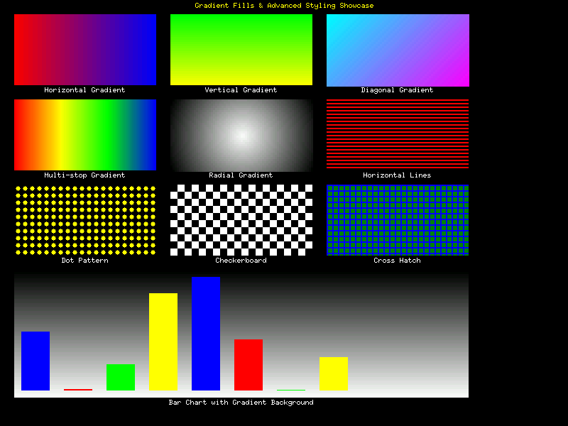
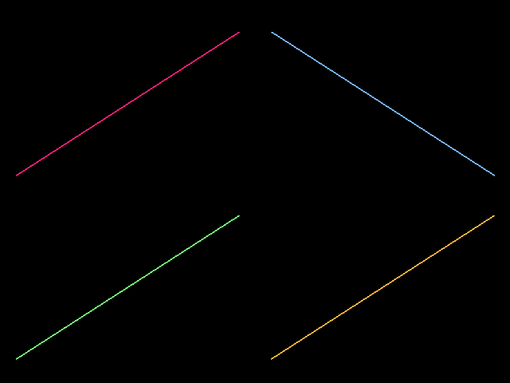

# Embedded Charts

[](https://crates.io/crates/embedded-charts)
[](https://docs.rs/embedded-charts)
[](https://github.com/signal-slot/embedded-charts/actions)
[](https://github.com/signal-slot/embedded-charts#license)
[](https://blog.rust-lang.org/2024/11/28/Rust-1.83.0.html)

A production-ready, high-performance chart library for embedded systems and resource-constrained environments. Built on [embedded-graphics](https://github.com/embedded-graphics/embedded-graphics), it provides comprehensive charting capabilities with full `no_std` support.

## ✨ Key Features

- 🎯 **Production Ready**: Memory-efficient, optimized for resource-constrained systems
- 📊 **Complete Chart Suite**: Line, bar, pie, donut, gauge, scatter, and smooth curve charts
- 🌊 **Advanced Interpolation**: Cubic spline, Catmull-Rom, and Bezier curve smoothing
- 🚀 **Real-time Streaming**: Live data updates with smooth animations and transitions
- 🎨 **Professional Styling**: Themes, gradient fills, pattern fills, and customizable appearance
- 📈 **Smart Data Handling**: Logarithmic scales, data aggregation, LTTB downsampling
- 🏗️ **Dashboard Layouts**: Grid-based composition for multi-chart displays
- 💾 **Memory Efficient**: Static allocation, configurable capacity, zero heap usage
- 🔧 **Fully Configurable**: Modular features, extensive customization options
- 🌐 **Universal Compatibility**: Works with any display supporting embedded-graphics

## 🎨 Visual Showcase

### Professional Theme Collection

*Complete collection of professional color themes optimized for different display types and use cases*

### Chart Type Gallery
<div align="center">
  <table>
    <tr>
      <td align="center">
        
        <br><b>Line Charts</b><br><sub>Multi-series, markers, area filling</sub>
      </td>
      <td align="center">
        
        <br><b>Smooth Curve Charts</b><br><sub>Cubic spline, Catmull-Rom, Bezier interpolation</sub>
      </td>
      <td align="center">
        
        <br><b>Bar Charts</b><br><sub>Vertical/horizontal, stacked support</sub>
      </td>
    </tr>
    <tr>
      <td align="center">
        
        <br><b>Pie Charts</b><br><sub>Full circles, custom colors, professional styling</sub>
      </td>
      <td align="center">
        
        <br><b>Donut Charts</b><br><sub>Hollow centers, percentage-based sizing, embedded-optimized</sub>
      </td>
      <td align="center">
        
        <br><b>Gauge Charts</b><br><sub>Semicircle/full circle, threshold zones, needle styles</sub>
      </td>
      <td align="center">
        
        <br><b>Scatter Charts</b><br><sub>Bubble charts, collision detection, clustering</sub>
      </td>
    </tr>
  </table>
</div>

### Advanced Styling & Layouts
<div align="center">
  <table>
    <tr>
      <td align="center">
        
        <br><b>Gradient Fills & Patterns</b><br><sub>Linear/radial gradients, pattern fills, optimized rendering</sub>
      </td>
      <td align="center">
        
        <br><b>Dashboard Composition</b><br><sub>Grid layouts, flexible positioning, responsive design</sub>
      </td>
    </tr>
  </table>
</div>


### Real-time Animation Demonstrations
<div align="center">
  <table>
    <tr>
      <td align="center">
        
        <br><b>Real-time Streaming</b><br><sub>Live data updates with smooth animations</sub>
      </td>
      <td align="center">
        
        <br><b>IoT Sensor Dashboard</b><br><sub>Multi-sensor real-time monitoring</sub>
      </td>
    </tr>
    <tr>
      <td align="center">
        
        <br><b>Production Auto-Redraw</b><br><sub>Real-time production monitoring with automatic updates</sub>
      </td>
      <td align="center">
        
        <br><b>System Monitoring</b><br><sub>Comprehensive system metrics visualization</sub>
      </td>
    </tr>
  </table>
</div>

### 🔄 Real-time Data Streaming with Ring Buffers

<div align="center">
  
  <br><b>High-Performance Ring Buffer</b><br>
  <sub>Real-time data streaming with chronological ordering, moving averages, and buffer visualization</sub>
</div>

The library includes a high-performance ring buffer implementation for efficient real-time data streaming:

```rust
use embedded_charts::prelude::*;
use embedded_charts::data::{PointRingBuffer, RingBuffer, RingBufferConfig};

// Create ring buffer with 100-point capacity
let mut data_buffer: PointRingBuffer<100> = PointRingBuffer::new();

// Configure for real-time streaming
let config = RingBufferConfig {
    overflow_mode: OverflowMode::Overwrite,  // Overwrite oldest data
    enable_events: true,                      // Event notifications
    track_bounds: true,                       // Auto bounds tracking
    ..Default::default()
};

let mut streaming_buffer: RingBuffer<Point2D, 100> = RingBuffer::with_config(config);

// Set up event handler
streaming_buffer.set_event_handler(|event| match event {
    RingBufferEvent::BufferFull => println!("Buffer is now full!"),
    RingBufferEvent::BoundsChanged => println!("Data bounds have changed"),
    _ => {}
});

// Stream data through the buffer
loop {
    let sensor_value = read_sensor();
    streaming_buffer.push_point(Point2D::new(timestamp, sensor_value))?;
    
    // Use chronological iterator for proper time ordering
    let mut chart_data = StaticDataSeries::<Point2D, 256>::new();
    for point in streaming_buffer.iter_chronological() {
        chart_data.push(*point)?;
    }
    
    // Calculate moving average
    if let Some(avg) = streaming_buffer.moving_average(20) {
        display_average(avg);
    }
}
```

**Key Features:**
- 🚀 **Zero allocation** after initialization
- 📊 **Chronological iteration** even with wrap-around
- 📈 **Built-in statistics**: moving average, rate of change, downsampling
- 🎯 **Event-driven architecture** with configurable overflow behavior
- 📍 **Automatic bounds tracking** for dynamic axis scaling
- 🔧 **No unsafe code** - memory safe by design

## 🚀 Quick Start

### Installation

Add to your `Cargo.toml`:

```toml
[dependencies]
embedded-charts = "0.3.0-dev"
embedded-graphics = "0.8"
```

### Simple Line Chart (30 seconds to working chart)

```rust
use embedded_charts::prelude::*;
use embedded_graphics::{pixelcolor::Rgb565, prelude::*};

fn main() -> Result<(), Box<dyn std::error::Error>> {
    // Create sample data
    let data = data_points![(0.0, 10.0), (1.0, 20.0), (2.0, 15.0), (3.0, 25.0)];

    // Build chart with fluent API
    let chart = LineChart::builder()
        .line_color(Rgb565::BLUE)
        .line_width(2)
        .with_title("Temperature Over Time")
        .background_color(Rgb565::WHITE)
        .build()?;

    // Render to any embedded-graphics display
    let viewport = Rectangle::new(Point::zero(), Size::new(320, 240));
    chart.draw(&data, chart.config(), viewport, &mut display)?;
    
    Ok(())
}
```

### Smooth Curve Chart (Advanced Interpolation)

```rust
use embedded_charts::prelude::*;
use embedded_charts::chart::CurveChart;
use embedded_charts::math::interpolation::InterpolationType;

fn main() -> Result<(), Box<dyn std::error::Error>> {
    // Temperature data over 24 hours
    let data = data_points![
        (0.0, 20.0), (3.0, 15.0), (6.0, 25.0), (9.0, 35.0), 
        (12.0, 40.0), (15.0, 30.0), (18.0, 22.0), (21.0, 18.0), (24.0, 20.0)
    ];

    // Build smooth curve chart with Catmull-Rom interpolation
    let chart = CurveChart::builder()
        .line_color(Rgb565::BLUE)
        .line_width(3)
        .interpolation_type(InterpolationType::CatmullRom)
        .subdivisions(4)
        .tension(0.5)
        .fill_area(Rgb565::CSS_LIGHT_BLUE)
        .with_markers(MarkerStyle {
            shape: MarkerShape::Circle,
            size: 12,
            color: Rgb565::RED,
            visible: true,
        })
        .with_title("Temperature Over Time - Smooth Curve")
        .build()?;

    // Render smooth interpolated curve
    let viewport = Rectangle::new(Point::zero(), Size::new(800, 600));
    chart.draw(&data, chart.config(), viewport, &mut display)?;
    
    Ok(())
}
```

### Professional Dashboard (Multi-series with Legend)

```rust
use embedded_charts::prelude::*;

fn create_dashboard() -> ChartResult<()> {
    // Create multiple data series
    let temp_data = data_points![(0.0, 22.5), (1.0, 23.1), (2.0, 24.2), (3.0, 23.8)];
    let humidity_data = data_points![(0.0, 65.0), (1.0, 68.0), (2.0, 72.0), (3.0, 70.0)];

    // Build professional multi-series chart
    let chart = LineChart::builder()
        .line_color(Rgb565::CSS_STEEL_BLUE)
        .line_width(2)
        .with_markers(MarkerStyle::circle(4, Rgb565::CSS_CRIMSON))
        .with_title("Environmental Monitoring")
        .background_color(Rgb565::WHITE)
        .build()?;

    // Create legend
    let legend = StandardLegendBuilder::new()
        .position(LegendPos::TopRight)
        .add_line_entry("Temperature", Rgb565::CSS_STEEL_BLUE)?
        .add_line_entry("Humidity", Rgb565::CSS_ORANGE)?
        .professional_style()
        .build()?;

    // Render both chart and legend
    chart.draw(&temp_data, chart.config(), viewport, &mut display)?;
    legend_renderer.render(&legend, legend_area, &mut display)?;
    
    Ok(())
}
```

### Gradient Fills Example

```rust
use embedded_charts::prelude::*;
use embedded_charts::style::{LinearGradient, GradientDirection, PatternFill, PatternType};

fn gradient_chart() -> ChartResult<()> {
    // Create a beautiful gradient background
    let gradient = LinearGradient::simple(
        Rgb565::new(0, 32, 64),   // Dark blue
        Rgb565::new(0, 128, 255), // Bright blue
        GradientDirection::Vertical,
    )?;
    
    // Create pattern fill for bars
    let pattern = PatternFill::new(
        Rgb565::YELLOW,
        Rgb565::new(255, 200, 0), // Orange
        PatternType::Checkerboard { size: 4 },
    );
    
    // Apply gradient to chart background
    let chart = BarChart::builder()
        .bar_width(BarWidth::Fixed(40))
        .background_gradient(gradient)
        .bar_pattern(pattern)
        .build()?;
    
    Ok(())
}
```

### Chart Animations Example

```rust
use embedded_charts::prelude::*;
use embedded_charts::animation::{ChartAnimator, EasingFunction};

fn animated_transitions() -> ChartResult<()> {
    // Create animator for smooth transitions
    let mut animator = ChartAnimator::<Point2D, 100>::new();
    
    // Set up animation with easing
    animator.configure(AnimationConfig {
        duration_ms: 1000,
        easing: EasingFunction::EaseInOutCubic,
        loop_animation: false,
    });
    
    // Animate between data states
    let initial_data = data_points![(0.0, 10.0), (1.0, 20.0), (2.0, 15.0)];
    let target_data = data_points![(0.0, 25.0), (1.0, 15.0), (2.0, 30.0)];
    
    animator.transition(&initial_data, &target_data)?;
    
    // Render animation frames
    loop {
        let progress = animator.update(16); // 60 FPS
        let interpolated = animator.get_interpolated_data(progress)?;
        
        chart.draw(&interpolated, config, viewport, &mut display)?;
        
        if animator.is_complete() { break; }
    }
    
    Ok(())
}
```

### Dashboard Layout Example

```rust
use embedded_charts::prelude::*;
use embedded_charts::dashboard::{DashboardLayout, GridPosition};

fn create_dashboard_layout() -> ChartResult<()> {
    // Create 2x2 grid dashboard
    let mut dashboard = DashboardLayout::new(2, 2);
    
    // Add charts to grid positions
    dashboard.add_chart(
        GridPosition::new(0, 0),
        create_temperature_chart()?,
    );
    
    dashboard.add_chart(
        GridPosition::new(1, 0),
        create_humidity_chart()?,
    );
    
    // Add wide chart spanning 2 columns
    dashboard.add_chart_with_span(
        GridPosition::new(0, 1),
        2, 1, // span 2 columns, 1 row
        create_trend_chart()?,
    );
    
    // Render complete dashboard
    dashboard.render(&mut display)?;
    
    Ok(())
}
```

### Data Aggregation Example

```rust
use embedded_charts::prelude::*;
use embedded_charts::data::{DataAggregator, AggregationStrategy};

fn aggregate_large_dataset() -> ChartResult<()> {
    // Large dataset with 10,000 points
    let large_data = generate_sensor_data(10_000);
    
    // Downsample to 200 points using LTTB algorithm
    let aggregator = DataAggregator::new()
        .strategy(AggregationStrategy::LTTB)
        .target_points(200);
    
    let downsampled = aggregator.process(&large_data)?;
    
    // Alternative: Statistical aggregation
    let stats_aggregator = DataAggregator::new()
        .strategy(AggregationStrategy::Mean)
        .group_size(50); // Average every 50 points
    
    let averaged = stats_aggregator.process(&large_data)?;
    
    // Render efficiently with downsampled data
    chart.draw(&downsampled, config, viewport, &mut display)?;
    
    Ok(())
}
```

### Embedded System Usage (no_std)

```rust
#![no_std]
#![no_main]

use embedded_charts::prelude::*;
use embedded_graphics::{pixelcolor::Rgb565, prelude::*};

fn main() -> ! {
    // Initialize your embedded display
    let mut display = init_display();
    
    // Create data series with static allocation
    let mut sensor_data: StaticDataSeries<Point2D, 64> = StaticDataSeries::new();
    
    // Collect sensor readings
    for i in 0..32 {
        let reading = read_temperature_sensor();
        let _ = sensor_data.push(Point2D::new(i as f32, reading));
    }

    // Create minimal chart optimized for small displays
    let chart = LineChart::builder()
        .line_color(Rgb565::GREEN)
        .line_width(1)
        .build()
        .unwrap();

    // Render to 128x64 OLED display
    let viewport = Rectangle::new(Point::zero(), Size::new(128, 64));
    chart.draw(&sensor_data, chart.config(), viewport, &mut display).unwrap();
    
    loop {
        // Update display periodically
    }
}
```

## 📊 Complete Feature Matrix

| Chart Type | Status | Key Features |
|------------|--------|--------------|
| **Line Charts** | ✅ | Multi-series, markers, area filling, smooth animations |
| **Smooth Curve Charts** | ✅ | Cubic spline, Catmull-Rom, Bezier interpolation, configurable tension |
| **Bar Charts** | ✅ | Vertical/horizontal, stacked, gradient fills, pattern support |
| **Pie Charts** | ✅ | Full circles, custom colors, professional styling |
| **Donut Charts** | ✅ | Percentage-based sizing, helper methods, center content |
| **Gauge Charts** | ✅ | Semicircle/full, threshold zones, needle animations |
| **Scatter Charts** | ✅ | Bubble charts, collision detection, clustering |

| System Feature | Status | Description |
|----------------|--------|-------------|
| **Real-time Animation** | ✅ | Smooth transitions, easing functions, streaming data |
| **Ring Buffer Streaming** | ✅ | High-performance circular buffers with chronological ordering |
| **Gradient Fills** | ✅ | Linear/radial gradients, pattern fills, multi-stop support |
| **Dashboard Layouts** | ✅ | Grid-based composition, flexible positioning, presets |
| **Advanced Scales** | ✅ | Logarithmic, custom transformations, auto-tick generation |
| **Data Aggregation** | ✅ | LTTB downsampling, statistical aggregation, memory-efficient |
| **Professional Styling** | ✅ | Themes, gradients, patterns, advanced typography |
| **Memory Management** | ✅ | Static allocation, configurable capacity, zero heap |
| **no_std Support** | ✅ | Full embedded compatibility, minimal dependencies |
| **Math Backends** | ✅ | Float, fixed-point, integer-only, CORDIC |
| **Display Compatibility** | ✅ | OLED, TFT, E-Paper, custom displays |

## 🛠️ Configuration Guide

### Feature Flags

Configure the library precisely for your needs:

```toml
[dependencies]
embedded-charts = { 
    version = "0.3.0-dev",
    default-features = false,
    features = [
        # Target environment
        "std",                    # or "no_std" for embedded
        
        # Chart types (pick what you need)
        "line",                   # Line charts
        "bar",                    # Bar charts  
        "pie",                    # Pie and donut charts
        "scatter",                # Scatter and bubble charts
        "gauge",                  # Gauge and dial charts
        
        # Math backend (choose one)
        "floating-point",         # Full floating-point (recommended)
        "fixed-point",            # Fixed-point arithmetic
        "integer-math",           # Integer-only (most constrained)
        
        # Enhanced features
        "animations",             # Real-time animations
        "color-support",          # Professional color palettes
        "smooth-curves",          # Advanced curve interpolation (cubic spline, Catmull-Rom, Bezier)
    ]
}
```

### Memory Configuration Examples

```rust
// Ultra-constrained: 32 data points, minimal features
type SmallSeries = StaticDataSeries<Point2D, 32>;

// Standard embedded: 256 data points
type StandardSeries = StaticDataSeries<Point2D, 256>;

// High-capacity: 1024 data points for data logging
type LargeSeries = StaticDataSeries<Point2D, 1024>;
```

## 🎯 Use Cases & Examples

### 📊 IoT Sensor Monitoring
Perfect for displaying sensor data on embedded displays:
- Temperature/humidity tracking
- Environmental monitoring stations  
- Industrial sensor networks
- Smart home dashboards

### 🏭 Industrial HMI
Human-Machine Interface applications:
- Real-time process monitoring
- Equipment status dashboards
- Production line analytics
- Quality control charts

### 🏥 Medical Devices
Medical and health monitoring:
- Vital sign displays
- Patient monitoring systems
- Diagnostic equipment interfaces
- Portable health devices

### 🚗 Automotive Displays
Vehicle dashboard and infotainment:
- Instrument clusters
- Performance monitoring
- Navigation route display
- Vehicle diagnostics

## 📱 Display Compatibility

### Tested Display Types
- **OLED**: SSD1306, SH1106, SSD1351
- **TFT**: ST7735, ILI9341, ST7789
- **E-Paper**: Waveshare 2.9", 4.2", 7.5"
- **Memory LCD**: Sharp Memory Displays
- **Custom**: Any display implementing embedded-graphics `DrawTarget`

### Resolution Recommendations
| Display Size | Chart Types | Recommended Features |
|-------------|-------------|---------------------|
| **128x64** | Line, Bar | Minimal styling, 1px lines |
| **240x135** | Line, Bar, Pie | Basic styling, legends |
| **320x240** | All types | Full features, animations |
| **480x320+** | All types | Professional styling, complex layouts |

## 🔬 Advanced Examples

### Real-time Data Streaming

```rust
use embedded_charts::prelude::*;

fn streaming_dashboard() -> ChartResult<()> {
    // Create sliding window for continuous data
    let mut stream = SlidingWindowSeries::<Point2D, 100>::new();
    
    // Set up animated chart
    let chart = LineChart::builder()
        .line_color(Rgb565::CSS_LIME_GREEN)
        .line_width(2)
        .fill_area(Rgb565::new(0, 8, 0)) // Semi-transparent fill
        .with_animation(AnimationConfig {
            duration: 500,
            easing: EasingFunction::EaseInOut,
        })
        .build()?;

    // Simulation loop
    for i in 0..1000 {
        // Add new data point
        let timestamp = i as f32 * 0.1;
        let value = 50.0 + 20.0 * (timestamp * 0.5).sin();
        stream.push(Point2D::new(timestamp, value))?;
        
        // Render with smooth animation
        chart.draw(&stream, chart.config(), viewport, &mut display)?;
        
        // Update every 100ms
        std::thread::sleep(std::time::Duration::from_millis(100));
    }
    
    Ok(())
}
```

### Multi-Chart Dashboard

```rust
use embedded_charts::prelude::*;

fn create_multi_chart_dashboard() -> ChartResult<()> {
    // Divide display into quadrants
    let display_size = Size::new(480, 320);
    let chart_size = Size::new(240, 160);
    
    // Create different chart types
    let line_chart = create_temperature_chart()?;
    let bar_chart = create_usage_chart()?;
    let pie_chart = create_distribution_chart()?;
    let gauge_chart = create_status_gauge()?;
    
    // Render in grid layout
    let viewports = [
        Rectangle::new(Point::new(0, 0), chart_size),     // Top-left
        Rectangle::new(Point::new(240, 0), chart_size),   // Top-right  
        Rectangle::new(Point::new(0, 160), chart_size),   // Bottom-left
        Rectangle::new(Point::new(240, 160), chart_size), // Bottom-right
    ];
    
    line_chart.draw(&temp_data, line_chart.config(), viewports[0], &mut display)?;
    bar_chart.draw(&usage_data, bar_chart.config(), viewports[1], &mut display)?;
    pie_chart.draw(&dist_data, pie_chart.config(), viewports[2], &mut display)?;
    gauge_chart.draw(&status_data, gauge_chart.config(), viewports[3], &mut display)?;
    
    Ok(())
}
```

### Custom Styling and Themes

```rust
use embedded_charts::prelude::*;

fn themed_charts() -> ChartResult<()> {
    // Dark theme for OLED displays
    let dark_theme = ChartTheme {
        background: Rgb565::BLACK,
        primary: Rgb565::CSS_CYAN,
        secondary: Rgb565::CSS_ORANGE,
        text: Rgb565::WHITE,
        grid: Rgb565::new(8, 8, 8),
    };
    
    // Professional theme for TFT displays  
    let professional_theme = ChartTheme {
        background: Rgb565::WHITE,
        primary: Rgb565::CSS_STEEL_BLUE,
        secondary: Rgb565::CSS_CRIMSON,
        text: Rgb565::BLACK,
        grid: Rgb565::new(20, 20, 20),
    };
    
    // Apply theme to chart
    let chart = LineChart::builder()
        .theme(dark_theme)
        .line_width(2)
        .with_grid(true)
        .build()?;
        
    Ok(())
}
```

## 🛡️ Error Handling & Debugging

The library provides comprehensive error handling:

```rust
use embedded_charts::prelude::*;

fn robust_chart_creation() {
    match create_chart() {
        Ok(chart) => {
            // Chart created successfully
            println!("Chart ready for rendering");
        }
        Err(ChartError::InsufficientData) => {
            println!("Need more data points to render chart");
        }
        Err(ChartError::MemoryFull) => {
            println!("Data series capacity exceeded");
        }
        Err(ChartError::InvalidConfiguration) => {
            println!("Chart configuration invalid");
        }
        Err(ChartError::RenderingError) => {
            println!("Display rendering failed");
        }
        Err(e) => {
            println!("Unexpected error: {:?}", e);
        }
    }
}
```

## 🚀 Performance & Optimization

### Memory Usage Guidelines

| Configuration | Memory Usage | Use Case |
|--------------|--------------|----------|
| **Minimal** (32 points, integer-math) | ~1KB | Ultra-constrained MCUs |
| **Standard** (256 points, floating-point) | ~8KB | Typical embedded systems |
| **Professional** (1024 points, all features) | ~32KB | High-end embedded systems |

### Performance Optimization Tips

1. **Choose appropriate math backend**:
   - `integer-math`: Fastest, most constrained
   - `fixed-point`: Good balance of speed and precision
   - `floating-point`: Most features, moderate performance

2. **Optimize data series size**:
   - Use smallest capacity that meets your needs
   - Consider sliding windows for continuous data

3. **Minimize feature flags**:
   - Only enable chart types you actually use
   - Disable animations on slow displays

## 📚 Documentation & Resources

- 📖 [API Documentation](https://docs.rs/embedded-charts) - Complete API reference
- 🎯 [Examples Collection](examples/) - 20+ working examples
- 📋 [Feature Guide](docs/EXAMPLES.md) - Comprehensive feature documentation
- 🔄 [Changelog](docs/CHANGELOG.md) - Version history and updates
- 🤝 [Contributing Guide](docs/CONTRIBUTING.md) - How to contribute

### Example Categories
- **Basic Charts**: Simple chart creation and styling
- **Interactive**: Multi-series charts with legends and animations  
- **Real-time**: Streaming data and live updates
- **Embedded**: no_std examples for constrained systems

## 🤝 Contributing

We welcome contributions! The library is actively maintained with:

- ✅ **Comprehensive test suite** (95%+ coverage)
- ✅ **CI/CD pipeline** with 17 feature combination tests
- ✅ **Documentation examples** with visual verification
- ✅ **Performance benchmarks** for embedded targets

To contribute:
1. Check existing [issues](https://github.com/signal-slot/embedded-charts/issues)
2. Read the [Contributing Guide](docs/CONTRIBUTING.md)
3. Submit a pull request with tests and documentation

## 🏆 Project Status

This library is **production-ready** and actively used in:
- Industrial IoT devices
- Medical monitoring equipment  
- Automotive dashboard systems
- Smart home controllers

### Stability Guarantees
- **API Stability**: Semantic versioning with clear upgrade paths
- **Memory Safety**: No unsafe code, comprehensive testing
- **Performance**: Optimized for resource-constrained environments
- **Compatibility**: Maintained compatibility with embedded-graphics ecosystem

## 📄 License

This project is dual-licensed under either of:

- Apache License, Version 2.0 ([LICENSE-APACHE](LICENSE-APACHE) or [apache.org/licenses/LICENSE-2.0](http://www.apache.org/licenses/LICENSE-2.0))
- MIT License ([LICENSE-MIT](LICENSE-MIT) or [opensource.org/licenses/MIT](http://opensource.org/licenses/MIT))

at your option.

## 🙏 Acknowledgments

- Built on the excellent [embedded-graphics](https://github.com/embedded-graphics/embedded-graphics) foundation
- Inspired by the embedded Rust community's needs for high-quality visualization
- Special thanks to all contributors, testers, and early adopters

---

<div align="center">
  <b>Ready to create beautiful charts in your embedded project?</b><br>
  <a href="https://docs.rs/embedded-charts">📖 Read the Docs</a> |
  <a href="examples/">🎯 Try Examples</a> |
  <a href="https://github.com/signal-slot/embedded-charts/issues">💬 Get Help</a>
</div>